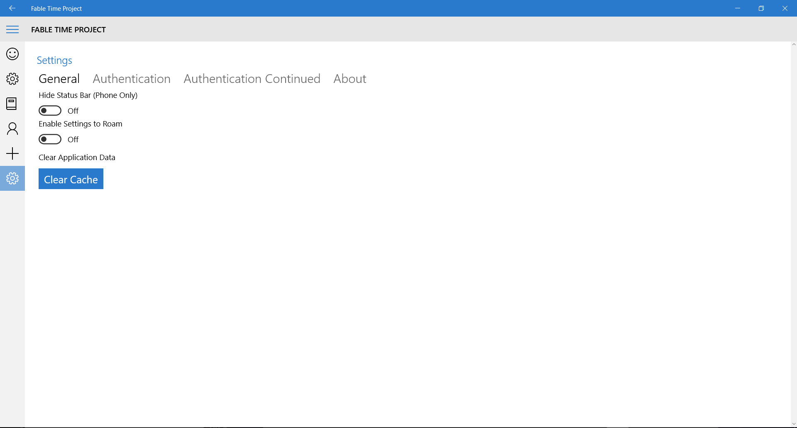
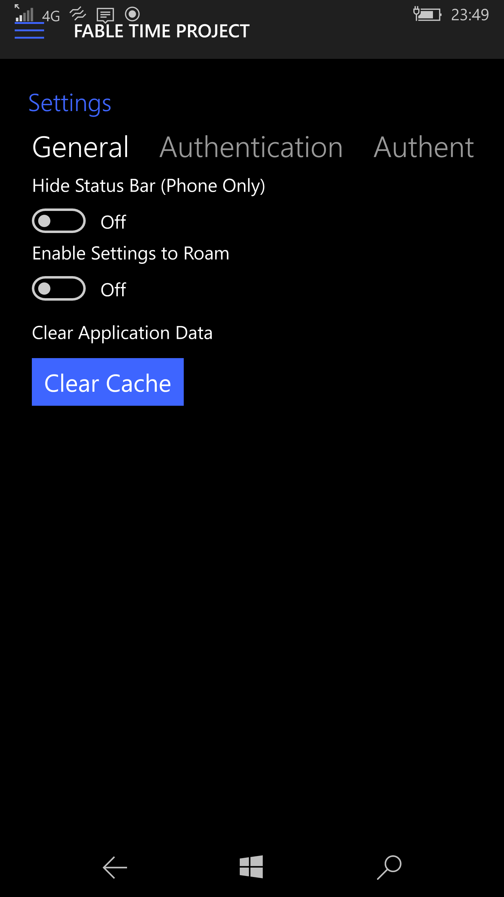
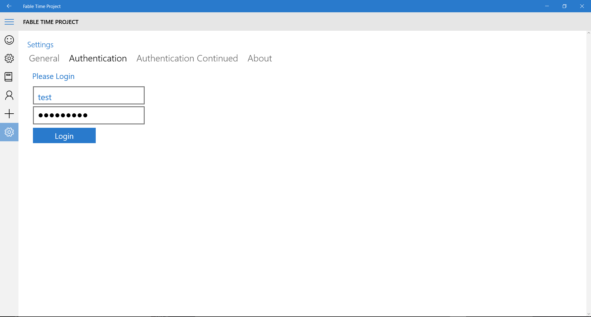
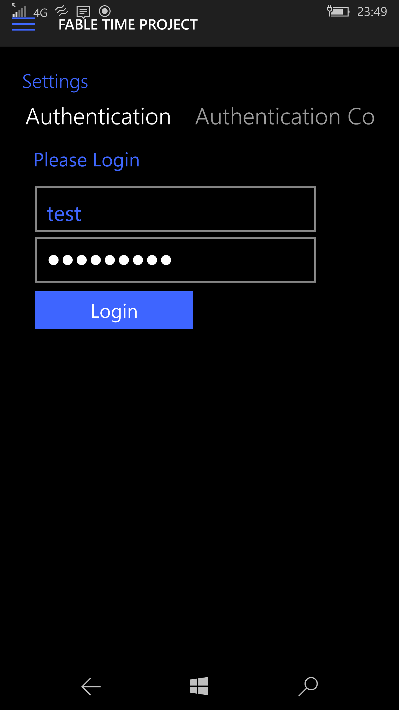

# Starting Out

When you start the App you will be greeted with the Welcome Page. This page will show information based on Updates to the App and the Web Service. Below is the **Desktop App:**

Below is the **Mobile App:**

For the first time you will not be signed in so you will need to log in or register to the App.

## Navigating to the Settings Page

Like to gain access to all the features? Then you will need to log in or register. To get an account or to log in then head to the **Settings Page**.

On *Mobile* you can swipe right from the left hand side or on both systems you can click on the **Hamburger Menu Icon**. As well on *Mobile Devices* you can use the side menu as a *Track-pad* and drag down or up to select the menu item you want to open. 

Below is the **Desktop App:**

Below is the **Mobile App:**

## Authenticate

Once you have navigated to the Settings Page you will be greeted by the following screen.

Below is the **Desktop App:**

Below is the **Mobile App:**

Once you have arrived at the Settings Page you will need to swipe from right to left to progress through the different sub-pages on **Mobile** or clicking on the sub-page headers on **Desktop**.

You can **log in** on the *Authenticate* sub-page or **register** on the *Authenticate Continued* sub-page, below is the user **Test** logging into the App on **Desktop** and **Mobile**.

Below is the **Desktop App:**

Below is the **Mobile App:**

Once you have **logged in** or you have **registered** then you can then fully use the App **Yay!!!!**

