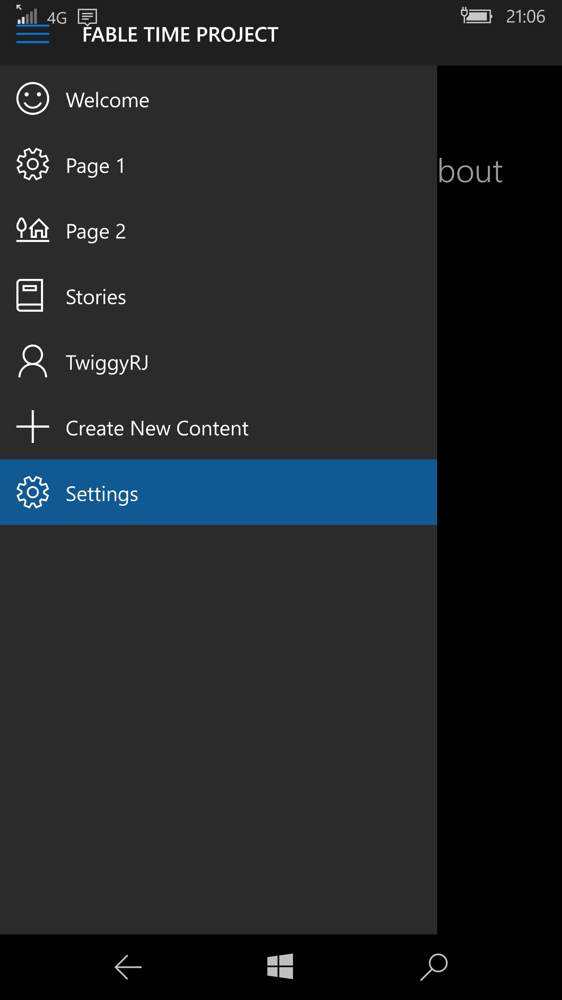

# Starting Out

When you start the App for the first time you will not be signed in.

## Authentication

Like to gain access to all the features? Then you will need to login or register. To get an account or to login then head to the **Settings Page**.

On *Mobile* you can swipe right from the left hand side or on both systems you can click on the **Hamburger Menu Icon**. 

Below is the **Desktop App:**

Below is the **Mobile App:**

