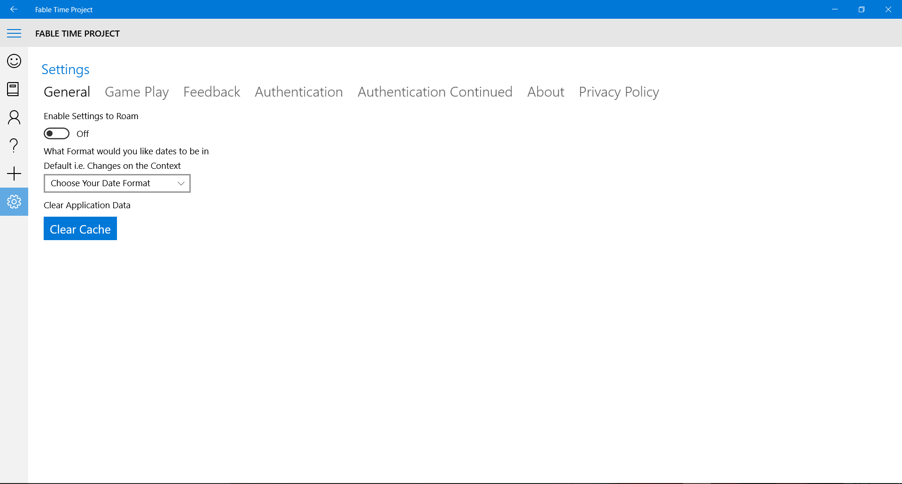
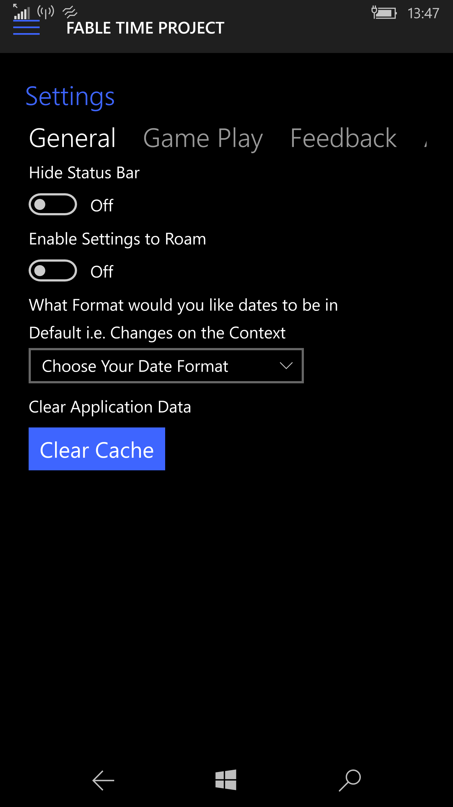
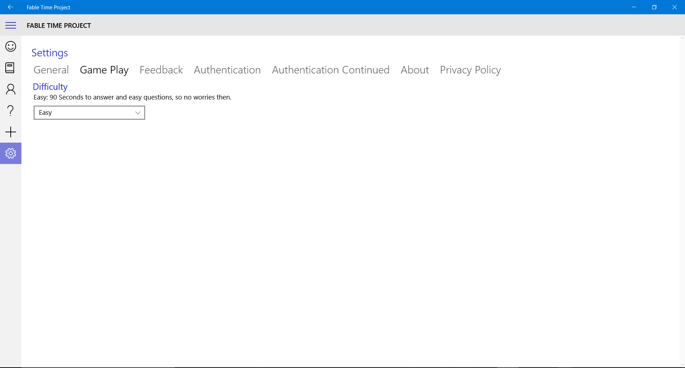
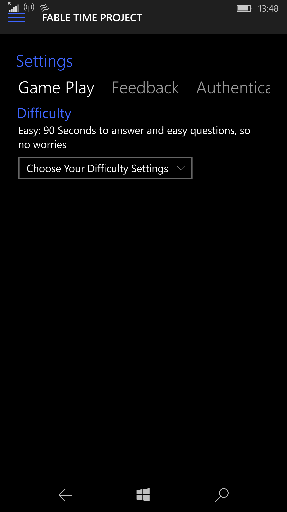
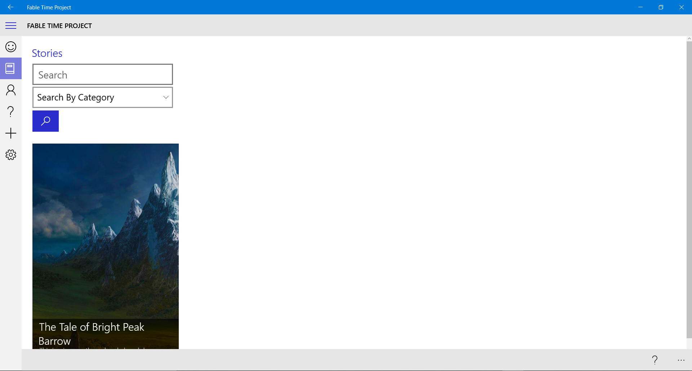
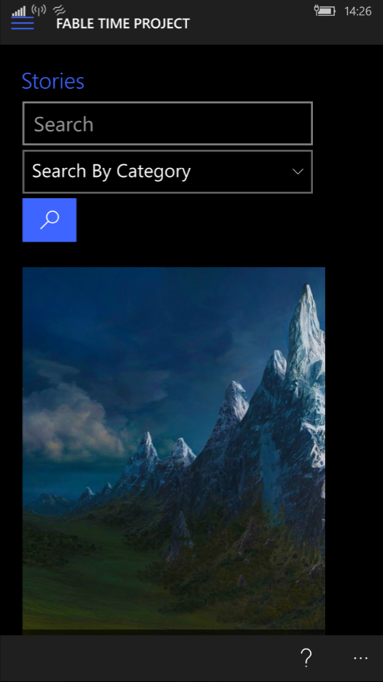

# How To Play
Once you have Logged in/Registered to the Fable Service, there will be game related settings that you can modify and change depending on your preferences. To change these settings, you will need to go to the **Settings Page.** Once you have arrived you will be greeted with this screen:

## Game Settings

Below is the **Desktop App:**

Below is the **Mobile App:**

 The *Date Format Settings* is an App wide setting, this means that it not just affects game play but also how dates are shown on every page of the App.
 
 The Game Play specific settings are in the **Game Play** section of the Settings Page.
 
 Below is the **Desktop App:**
 
 
 
Below is the **Mobile App:**
 
 
 From here you can choose your difficulty, the available options are:
 
| Difficulty | Affects on Game Play |
| -- | -- |
| Easy | Questions are easy and you have 90 seconds to answer  |
| Normal | Questions are of an average difficulty and you have 60 seconds to answer |
| Hard | Questions are difficult and you have 45 seconds to answer |
| Very Hard | Questions are the same as on Hard but you will have only 30 seconds to answer |
| Guffaws | Questions are comical and can be rude and feature foul language and you have 30 seconds to answer |

## Start Playing

Once you have chosen your difficulty you are ready to play, to play go to the **Stories Page.**

Below is the **Desktop App:**

Below is the **Mobile App:**

