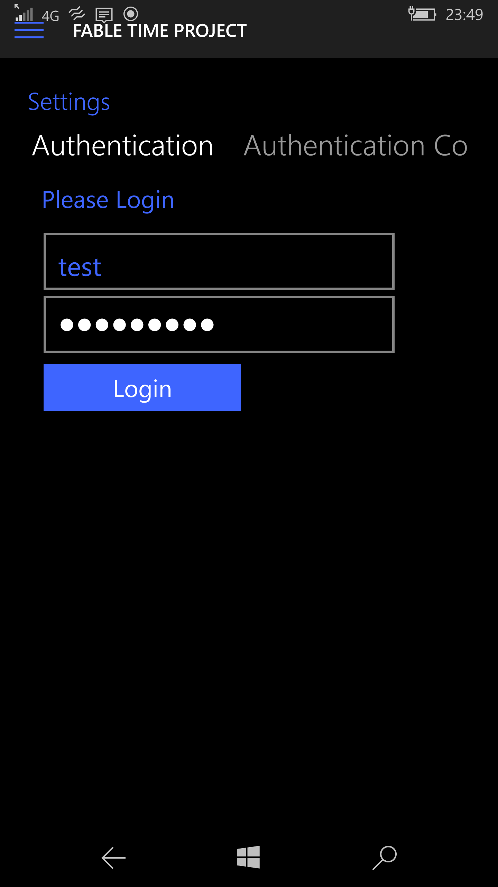

# How To Play
Once you have Logged in/Registered there are game related settings that you can modify and change depending on your preferences. To change these settings, you will need to go to the **Settings Page.** Once you have arrived you will be greeted with this screen:

## Game Settings

Below is the **Desktop App:**

Below is the **Mobile App:**

