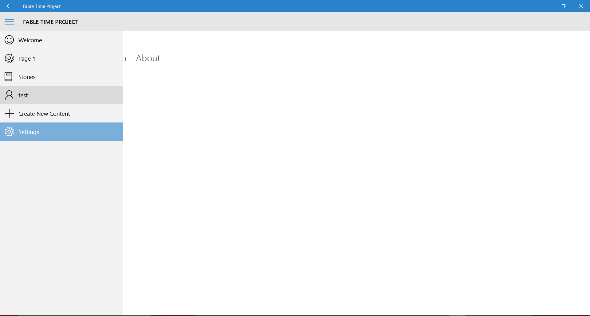
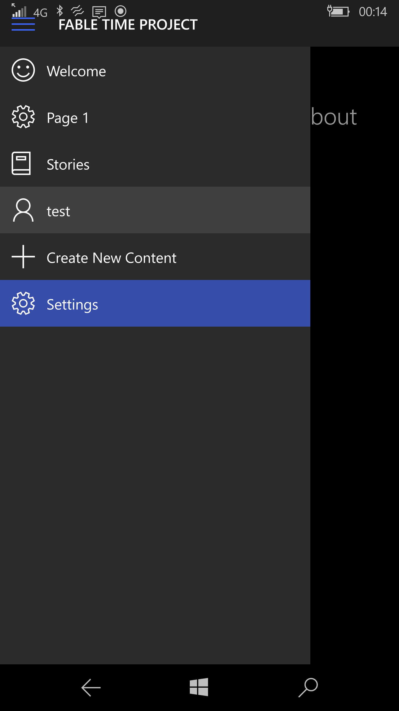
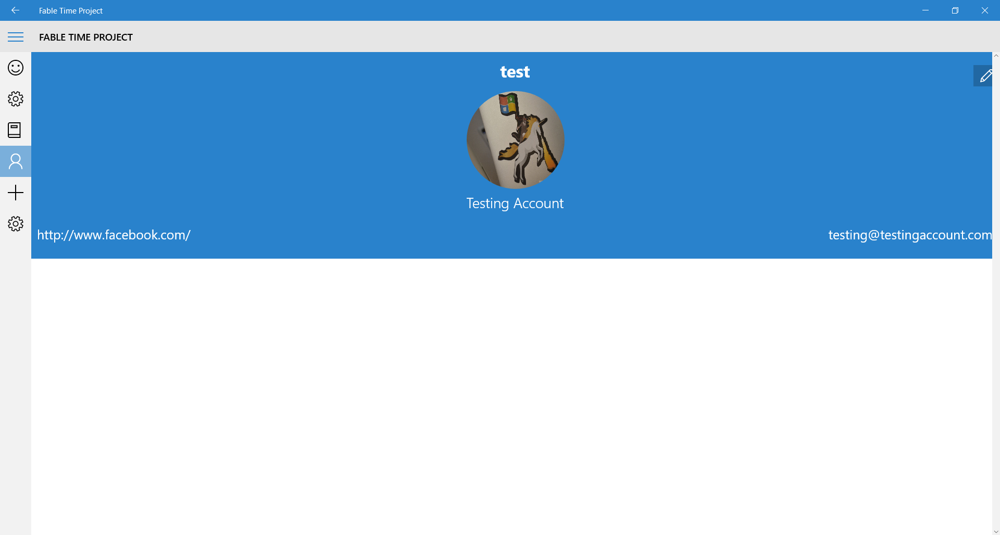
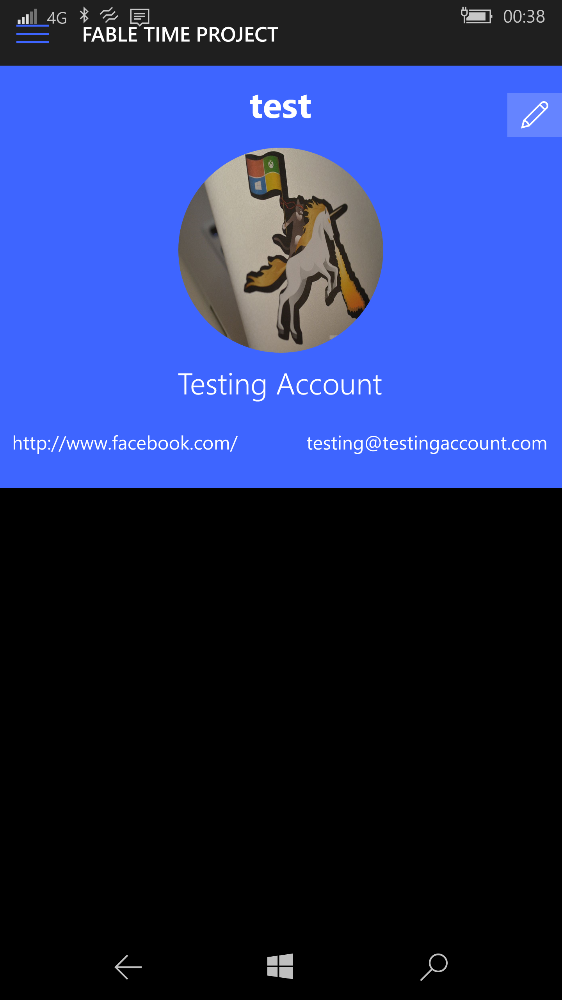

# About Your Profile

Once you have logged in you will want to checkout your profile page. To do this you should open the **Hamburger Menu** and select **Profile Page** or the entry with your **Username** on.

Below is the **Desktop App:**

Below is the **Mobile App:**

Once you have navigated to the profile page you will be greeted with the following page.

Below is the **Desktop App:**

Below is the **Mobile App:**
